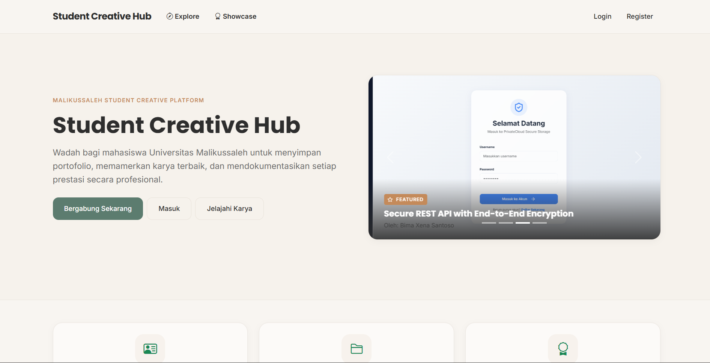

<div align="center">

# Student Creative Hub

### Ekosistem digital terpadu untuk memamerkan, mengelola, dan memvalidasi portofolio serta pencapaian mahasiswa

*Dari draft proyek kuliah sampai portofolio siap pamer — satu platform, satu alur kerja.*

[](https://laravel.com)
[](https://php.net)
[](https://getbootstrap.com)
[](https://vitejs.dev)

</div>

<br>



<br>

## Ringkasan

Student Creative Hub adalah platform manajemen portofolio yang dirancang khusus untuk lingkungan akademik. Aplikasi ini menjembatani kreativitas mahasiswa dengan sistem validasi terstruktur — mahasiswa membangun rekam jejak digital yang terverifikasi, sementara administrator mengkurasi karya terbaik dan memantau perkembangan talenta secara terpusat.

<br>

## Sekilas

| | |
|---|---|
| 🗂️ **Role-based Workflow** | Alur kerja terpisah untuk Admin dan Mahasiswa, lengkap dengan middleware keamanan berbasis peran |
| ✅ **Verifikasi Berlapis** | Proyek melewati alur *review* admin sebelum tayang, dengan jalur revisi tanpa merusak data asli |
| 📄 **Smart PDF Generator** | Portofolio PDF ter-generate otomatis, diurutkan cerdas berdasarkan showcase, popularitas, dan kelengkapan profil |
| 🔗 **QR Profile** | Setiap mahasiswa punya QR Code unik menuju profil publik — siap ditempel di CV atau kartu nama |
| 📊 **Analytics & Insight Engine** | Statistik kunjungan real-time dengan proteksi anti-spam dan rekomendasi otomatis berbasis rule |
| 🧾 **Audit Trail Penuh** | Setiap aksi krusial (approve, suspend, delete) tercatat otomatis untuk akuntabilitas |

<br>

---

## Fitur Utama

**Manajemen Portofolio Komprehensif**
Mahasiswa mengelola proyek, keahlian (dengan tingkat kemahiran), sertifikat, dan pencapaian akademik dalam satu dasbor terpusat.

**Sistem Verifikasi & Revisi Proyek**
Proyek yang diunggah wajib melalui verifikasi admin sebelum disetujui. Proyek yang sudah *approved* tidak bisa diedit sembarangan — mahasiswa harus mengajukan revisi resmi yang di-*merge* setelah disetujui.

**Smart Portfolio PDF Generator**
Menghasilkan resume portofolio dalam format PDF yang rapi, dengan urutan otomatis: proyek showcase lebih dulu, disusul yang paling banyak dilihat, lalu yang terbaru.

**QR Code Profil Terintegrasi**
QR Code unik per mahasiswa yang langsung mengarah ke halaman profil publik — praktis untuk media cetak atau digital.

**Analitik & Perlindungan Anti-Spam**
Pelacakan kunjungan dilengkapi mekanisme *session cooldown* dan *visitor hash* agar data analitik tetap otentik, plus mesin rekomendasi otomatis (misalnya peringatan profil belum lengkap atau QR belum pernah dipindai).

**Audit Trail & Keamanan**
Seluruh aksi krusial dicatat otomatis ke *audit log*, memastikan setiap perubahan data dapat ditelusuri.

<br>

---

## Tech Stack

Dibangun dengan arsitektur MVC yang diperkuat *service layer*, dirender sepenuhnya di sisi server (SSR) untuk performa optimal.

- **Backend:** Laravel 12 (PHP 8.2+)
- **Frontend / UI:** Laravel Blade, Bootstrap 5, Bootstrap Icons, Custom SASS
- **Asset Bundler:** Vite
- **Database:** MySQL / SQLite
- **Libraries Tambahan:** DOMPDF (PDF Generator), Simple-QRCode, Chart.js, SweetAlert2

<br>

---

## Instalasi Lokal

```bash
git clone https://github.com/s1eepym3/student-creative-hub.git
cd student-creative-hub
```

Instalasi lengkap (dependensi PHP & Node, `.env`, application key, migrasi, build aset) sudah dikemas dalam satu perintah:

```bash
composer setup
```

Jalankan server development (Laravel serve + queue listener + log viewer + Vite) secara bersamaan:

```bash
composer dev
```

Aplikasi dapat diakses di `http://localhost:8000`.

<br>

<details>
<summary><b>📁 Struktur Project</b></summary>
<br>

- `app/Http/Controllers/` — Logika routing dipisah berdasarkan peran (`Admin`, `Mahasiswa`, `Public`)
- `app/Services/` — Lapisan service untuk logika bisnis kompleks (`ProjectService`, `PortfolioPdfService`, `AnalyticsReportService`, dsb) agar controller tetap bersih
- `app/Models/` — Model Eloquent dengan relasi ter-eager-load
- `resources/views/` — Antarmuka Blade, terstruktur modular per peran
- `routes/web.php` — Definisi routing terpusat dengan middleware berbasis peran

</details>

<br>

---

<div align="center">

Dikembangkan sebagai bagian dari Kerja Praktik (KP).

</div>
